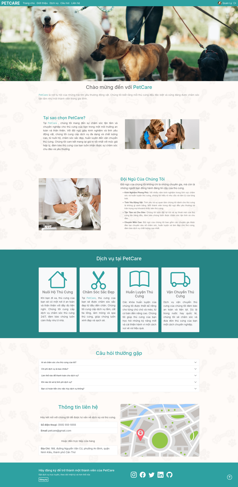
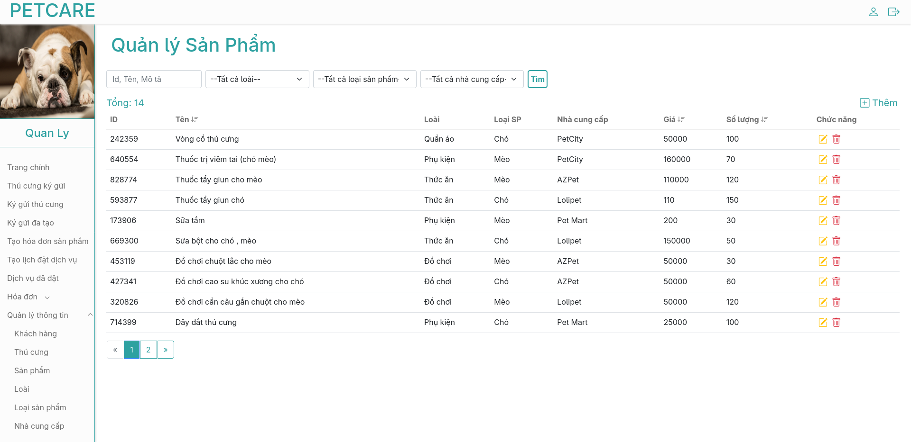
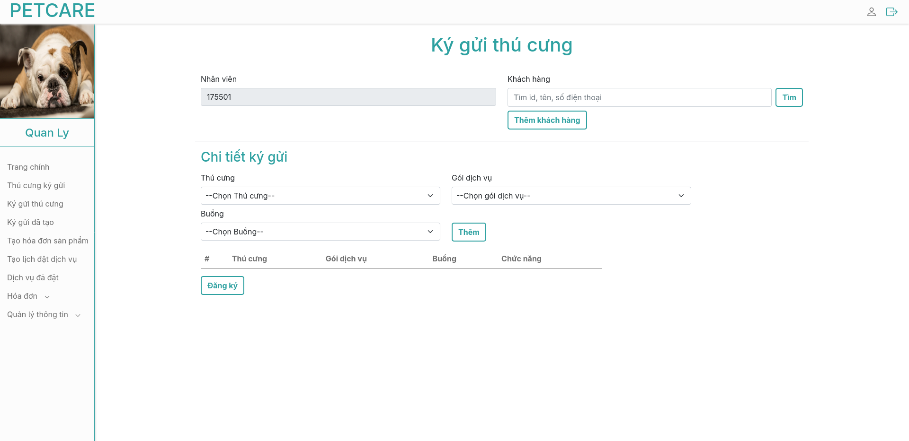

# 🐾 PetCare Web App  

This is a full-stack web application for managing **pet care services**.  
The project uses **Django** for the backend, **Angular** for the frontend, **PostgreSQL** as the database, and is fully containerized with **Docker**.  

---

## 🚀 Features
- Manage employees, services, and users 🐶  
- CRUD operations for pet care management  
- Backend powered by **Django REST Framework**  
- Frontend built with **Angular**  
- Data persistence with **PostgreSQL**  
- Fully containerized using **Docker Compose**  

---

## 🛠️ Tech Stack
- **Frontend:** Angular  
- **Backend:** Django  
- **Database:** PostgreSQL  
- **Containerization:** Docker & Docker Compose  

---

## 📸 Demo
Here are some demo images of the app in action:

  
  
  

---

## ⚙️ Installation & Setup

1. **Clone the repository**
   ```bash
   git clone https://github.com/LinhNguyen411/PetServices
   cd PetServices   

2. **Start Docker containers**
   ```bash
   docker-compose up -d --build

3. **Access the application**
 - Frontend: http://localhost:4200
 - Backend API: http://localhost:8000/admin

 ## 📝 Notes
 - Default admin account (only for django adminstation):
 Email: admin@admin.com
 Password: password

 - Default employee account:
 Email: quanly4759@petcares.com
 Password: password